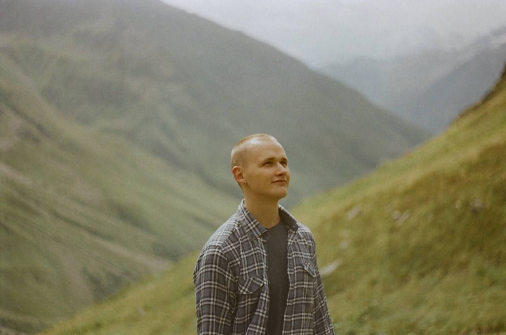

# Anton Burmagin

## *Contacts:*

> Kazakhstan, Almaty
+7 (705) 438-93-30 \
burmagin.ant.s@gmail.com\
Discord: @Anton187#0343

| **Experience**  |  **Education** |
|---|---:|
| **Scandiweb**, Latvia - remote, database enrichment specialist |  **St. Petersburg State University of Economics and Finance**, master degree
| 30.01.2023 - now | 01.09.2016 – 30.06.2018
| Enrichment of customers database| Innovation management
| **LSR Group**, Saint-Petersburg, sales manager | **St. Petersburg State Mining University**, master degree |
| 15.12.2017 - 27.09.2022| 01.09.2012 – 30.06.2016|
| Management of most valuable clients of development and building manufacturers |  Industrial management|

###  **Special courses:** 
> C++ developer, Skillbox\
2021-2022

###  **Skills:** 
> Visual Studio, C++, MySQL, Git, Qt

###  **Languages:** 
> English - B1/B2\
Russian - native

